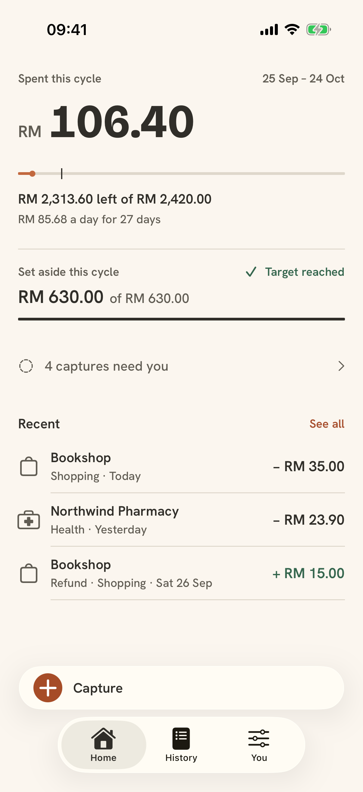
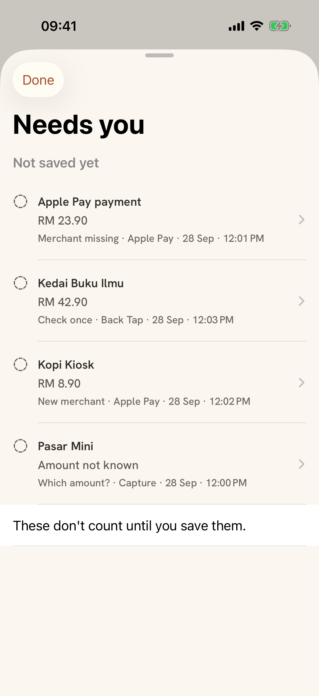
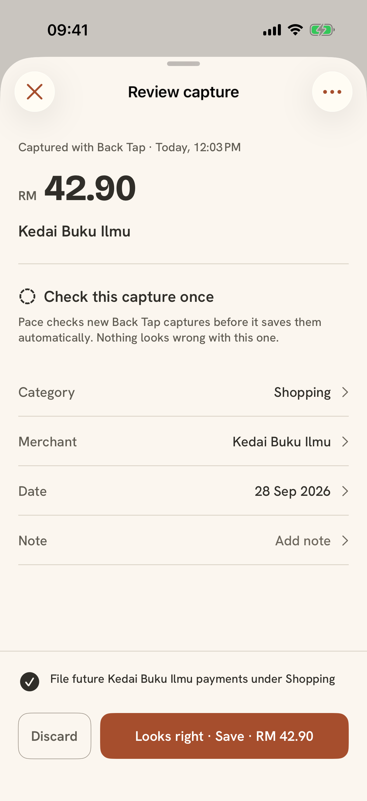
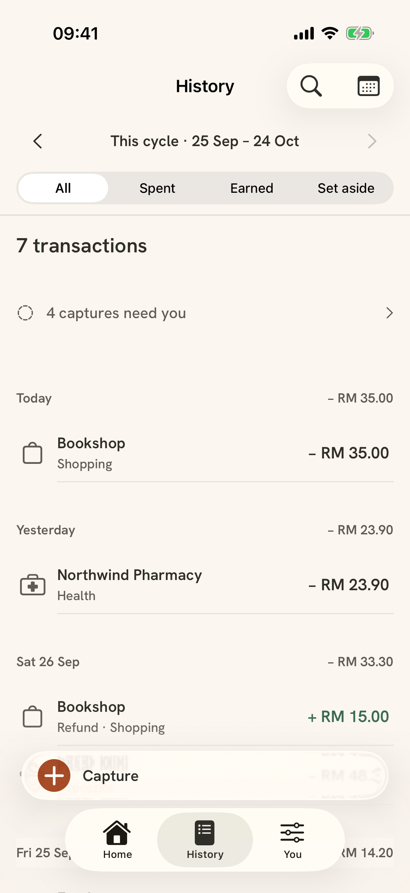
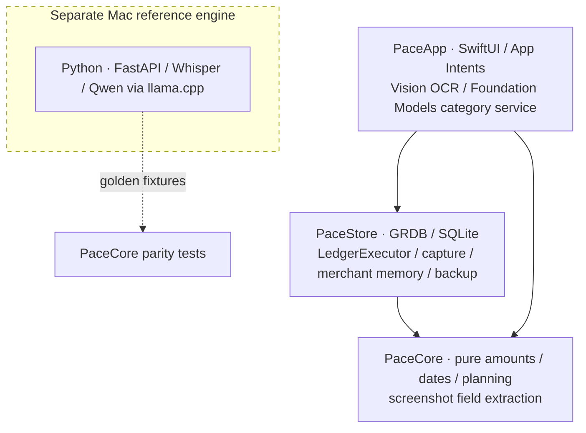

# Pace

A local-first personal-finance app for iPhone, built with SwiftUI. Pace keeps an on-device SQLite ledger, plans spending per pay cycle, and turns payment screenshots and Apple Pay events into drafts you review.

> **Active development · sanitized public snapshot.** Pace is a personal project I use daily. Development happens in a private repository; this is a reviewed snapshot of that code (as of 3 October 2026) with personal data, signing settings and internal notes removed. It is not on the App Store or TestFlight and has no server component.

Integer-money ledger rules, deterministic capture and shared Swift/Python fixtures make the core behavior inspectable.

The native app runs independently. The separate Mac-hosted reference engine included below has a local API server.

<table>
<tr><th>Home</th><th>Needs you</th><th>Review capture</th></tr>
<tr><td></td><td></td><td></td></tr>
<tr><th>History</th><td colspan="2">Synthetic demo data only. Capture provenance and reproduction steps: <a href="docs/media/README.md">screenshot notes</a>.</td></tr>
<tr><td></td><td colspan="2"></td></tr>
</table>

## What it does

- **Ledger:** expenses, income, refunds and savings contributions in integer minor units. Edits and deletes are undoable and recorded in an action log ([LedgerExecutor](native/Packages/PaceStore/Sources/PaceStore/LedgerExecutor.swift)).
- **Pay-cycle planning:** payday anchor, salary with dated changes, fixed or percentage savings, and fixed commitments. Home shows spent, left and left per day ([Planning](native/Packages/PaceCore/Sources/PaceCore/Planning.swift), [Finance](native/Packages/PaceCore/Sources/PaceCore/Finance.swift)).
- **History:** all-time search, flow filter and calendar view.
- **Capture into drafts:** a Shortcuts Wallet transaction automation passes the fields iOS exposes to `LogWalletPaymentIntent`. A user-built Shortcut passes an image to `LogScreenshotIntent`; Back Tap can be the iOS trigger. Missing or ambiguous values go to **Needs you** and are never silently saved.
- **Merchant memory:** remembered corrections are reused before a model is asked.
- **Backup and restore:** SQLite backup, JSON export and automatic rolling local snapshots.

## Architecture



- PaceApp owns presentation and Apple platform adapters; PaceStore owns persistence; PaceCore owns deterministic financial rules.
- PaceCore has no I/O and receives its clock, time zone and financial locale as inputs.
- An App Group database is shared by the app and its App Intents.
- Ledger changes are logged and undoable; capture/review components also write directly and log through the executor.
- DEBUG-only measurement harnesses are excluded from Release builds.

[Architecture and schema](docs/architecture.md) · [Capture pipeline](docs/capture-pipeline.md)

## How capture works

1. Vision `RecognizeTextRequest` uses accurate recognition mode for screenshot text with en-US and ms-MY language hints.
2. Deterministic extraction in PaceCore uses layout, typed spans, labels and relations to resolve amount, merchant, date/time and reference.
3. **Category:** merchant memory comes first. Without a match, Apple's on-device Foundation Models suggests one of Pace's fixed categories through guided generation (`@Generable`, `@Guide(.anyOf:)`, greedy sampling). If unavailable or unsuccessful, it falls back to **Other**.
4. A draft goes to review, or to **Needs you** when values are missing or ambiguous. Qualified complete captures can save under the explicit trust policy; safeguards still apply.

**The language model never supplies amounts, merchants or dates. Those come only from deterministic extraction over the OCR text.**

DEBUG-only `CategorizerBench`, `ScreenshotFMBench` and Capture Lab measure model choices and capture behavior. They are development tools, with fictional public fixture identifiers.

## Local reference engine (Python)

Before the native app, natural-language capture was prototyped as a **Mac-hosted** reference engine:

- FastAPI in [`noted/api.py`](noted/api.py).
- `mlx-whisper` large-v3-turbo transcription on the Mac.
- Local Qwen3.5-4B Q4_K_M via llama.cpp's `llama-server`, constrained to a JSON schema.
- Proposals rejected unless their cited spans match transcript substrings after text normalization (`_validate_verbatim_spans` in [`noted/llm.py`](noted/llm.py)).
- Deterministic amount/date resolution; uncertainty returns `needs_clarification` and nothing is saved.

The browser client in `public/` recorded audio; transcription ran on the Mac. **The iOS app does not use this engine and has no voice input.** Today the engine is the reference oracle: [`export_golden_fixtures.py`](scripts/export_golden_fixtures.py) generates shared JSONL data, and Swift tests must match it exactly. `noted` is the engine's original codename.

| Local model/run | Cases | Semantic validity | Intent accuracy | Median / p95 |
|---|---:|---:|---:|---:|
| [Qwen3.5-4B · earlier one-pass contract](bench/understanding/results/qwen3.5-4b-q4_k_m-one-pass-final.json) | 66 | 98.5% | 100.0% | 7.46 / 10.62 s |
| [Qwen3.5-2B · compact contract](bench/understanding/results/qwen3.5-2b-q4_k_m-v2-quality.json) | 86 | 91.9% | 81.4% | 1.33 / 1.56 s |

These recorded experiments use different contracts and corpora, so they are not a controlled head-to-head comparison. Latencies depend on the local runtime. [Reference-engine setup and benchmark method](docs/reference-engine.md) covers the curated files, including the sustained compact-contract run.

## Privacy and local-first design

No Pace Swift source uses networking, enforced by `OfflineGuardTests`. Native data lives in the device's App Group container. OCR and category suggestion run on device. There is no account, analytics or cloud sync. Backups are local files the user can export.

## Testing

Fresh staging validation on 4 October 2026:

| Suite | Framework | Result | Command |
|---|---|---|---|
| PaceCore | Swift Testing | 113 passed, 1 skipped; 114 total | `cd native/Packages/PaceCore && swift test` |
| PaceStore | Swift Testing | 118 passed | `cd native/Packages/PaceStore && swift test` |
| Native UI | XCTest | 38/38 passed on iPhone 17 Pro (37 existing + 1 showcase) | `xcodebuild test -project native/Pace.xcodeproj -scheme Pace -destination 'platform=iOS Simulator,name=<device>'` |
| Reference engine | pytest | 281 passed | `uv sync && uv run pytest -q` |
| Browser domain | Node test runner | 42 passed | `npm run check` |

The Release simulator build passed with signing disabled. Regenerating the Python and JavaScript golden fixtures left the tracked data unchanged; Swift parity tests compare those shared fixtures exactly. Unit tests use temporary stores and model doubles, not live ASR/model calls.

UI validation passes on the primary iPhone 17 Pro target (38/38). One additional Pro Max matrix navigation case remains under investigation and may be test-harness related; the cause is not confirmed. In that two-test Pro Max run, benchmark navigation passed and the matrix case failed after tapping the missing-amount row.

## Design decisions

- Integer minor-unit money keeps financial arithmetic explicit.
- A pure core with injected time and zone makes boundary cases reproducible.
- Drafts preserve uncertainty before a ledger change.
- Deterministic extraction precedes closed-set guided category generation.
- An explicit financial locale separates money rules from device region.
- Python-to-Swift golden parity checks the port against the reference implementation.
- GRDB migrations preserve local data as the schema evolves.

## Limitations

- Native voice capture is **not implemented**.
- Apple Pay capture depends on what iOS Shortcuts exposes; fields can be missing.
- Screenshot capture needs a user-configured Shortcut.
- Foundation Models needs an Apple Intelligence-capable device on iOS 26. Without it, categories fall back to merchant memory or Other.
- Formats are tuned for Malaysian Ringgit and Malaysian bank/e-wallet layouts.
- Single user, single device, no sync.
- The public snapshot lags private development.

## Current work

- Daily-driver UI refinement.
- Capture review and the Needs you flow.
- Broader screenshot-layout coverage.

## Running locally

Use Xcode 26 or later with an iOS 26 simulator. Open `native/Pace.xcodeproj`. For device builds, configure your own `PACE_BUNDLE_ID_PREFIX` and signing team in `native/Config/Pace.xcconfig`.

For fictional demo data, use a DEBUG build with `-PaceInMemory YES -PaceSeed showcase`. Add `-PaceFixedNow 2026-09-28T12:00:00+08:00 -PaceTimeZone Asia/Kuala_Lumpur` to reproduce the showcase date.

The separate reference engine needs an Apple Silicon Mac and `uv sync`. Models are downloaded separately and are not included. See [native setup](native/README.md) and [reference-engine setup](docs/reference-engine.md).

## Repository layout

```text
native/PaceApp/              SwiftUI and Apple platform adapters
native/Packages/PaceCore/    Pure financial and capture rules
native/Packages/PaceStore/   SQLite persistence and review
native/PaceUITests/          Native interaction tests
noted/                      Mac/Python reference engine
public/                     Reference-engine browser client
fixtures/golden/            Shared parity data
bench/                      Evaluation tools and curated results
scripts/                    Fixture exporters and local model launcher
tests/                      Python and Node tests
docs/                       Public architecture, capture and engine notes
```

## License

Source is published for review and reference; all rights reserved. Fonts (Bricolage Grotesque, Hanken Grotesk) are under the SIL Open Font License; see the bundled OFL files.
