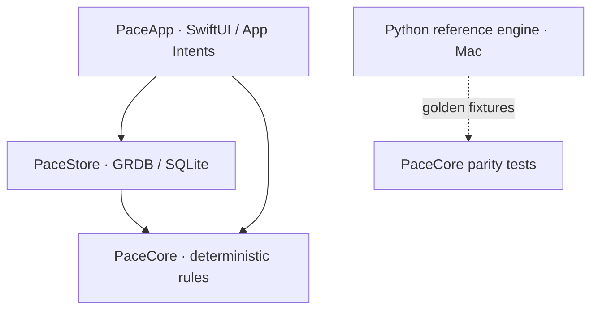

# Architecture

Pace is an active-development native iPhone application.
This repository is a sanitized snapshot of private development.
The native application stores its ledger locally.
The Mac reference engine is a separate implementation.

## Module boundaries

`native/PaceApp` owns presentation and Apple platform integrations.
It reads snapshots through `Queries` and coordinates user actions in `AppModel`.
Vision and Foundation Models adapters live in this module.
App Intents allow user-configured Shortcuts to deliver capture inputs.

`native/Packages/PaceCore` owns deterministic values and rules.
It normalizes amounts, resolves dates and computes spending plans.
Screenshot analysis uses OCR text and layout values supplied by the app.
It does not open files, query SQLite or call a model.
Clocks, time zones and financial locale are explicit inputs.

`native/Packages/PaceStore` owns persistence and capture processing.
It imports PaceCore and GRDB.
`PaceDatabase` wraps a database writer with foreign keys enabled.
File-backed use creates a `DatabasePool`; tests can use an in-memory store.
`LedgerExecutor` is the primary ledger mutation API.
Capture and review components also write directly and log through the executor.

## Data model

The authoritative schema is `PaceStore/Schema.swift`.
Its migrations are `v1` and `v2_capture`.

| Table | Responsibility |
|---|---|
| `categories` | Fixed expense and income category vocabulary |
| `merchants` | Canonical identity and remembered category |
| `merchant_aliases` | Normalized surfaces mapped to merchants |
| `merchant_context_rules` | Context-dependent category overrides |
| `recurring_rules` | Salary and dated recurring values |
| `transactions` | Confirmed ledger entries and capture drafts |
| `profile_versions` | Append-only planning settings |
| `preferences` | Local key/value preferences |
| `action_log` | Before/after values and undo relationships |
| `request_idempotency` | Durable replay identity for committed requests |
| `capture_outcomes` | Capture decisions and diagnostics |
| `capture_path_state` | Per-path trust stage and accumulated evidence |
| `capture_feedback` | Reviewed field errors linked to actions |

The first migration establishes the ledger and planning tables.
The capture migration rebuilds transactions to permit incomplete drafts.
Confirmed rows require a positive bounded amount.
Drafts can carry a missing amount without entering confirmed spending totals.
Contribution rows have no category; confirmed non-contributions have one.
Indexes support date queries, category queries and capture deduplication.

## Money and time

Amounts use integer minor units: RM12.90 is stored as 1290.
Expense, income, refund and contribution are separate flow types.
Refunds reduce spending; they do not become earnings.
Savings contributions remain distinct from expenses.
Formatting uses an explicit Malaysian financial locale.
Device region cannot silently change the amount interpretation.

An `Instant` identifies a point in time.
A `LocalDate` identifies the ledger day in the selected zone.
The stored transaction also retains its zone identifier.
Planning uses a payday anchor and clamps short months to month end.
Salary changes are dated, preserving the interpretation of earlier cycles.
The core receives time values rather than reading the current clock.

## Persistence and undo

The application and App Intents share an App Group database.
The generic bundle prefix in this snapshot is `com.example`.
A device build needs its own identifier and signing configuration.
No signing team is included.

Ledger actions persist before/after snapshots with their audit record.
Request fingerprints prevent a reused request ID from changing meaning.
Undo restores the recorded state rather than recomputing an old action.
Soft deletion preserves rows needed by audit and undo relationships.
Capture drafts are reviewed before incomplete fields become confirmed values.

## Backups and development tools

SQLite backup and JSON export are local file operations.
Restore retains a safety snapshot of the prior data.
Automatic rolling snapshots support local recovery.
The user is responsible for copies exported outside the application.

Capture Lab, category benchmarks and screenshot benchmarks are DEBUG tools.
They are excluded from the Release application.
Demo seeds run only in DEBUG builds with an in-memory database.
The public showcase seed uses fictional transactions and capture drafts.
The screenshot workflow never invokes an App Intent or a physical device.

## Validation boundaries

PaceCore tests check normalization, planning and capture extraction.
PaceStore tests check schema, mutations, review, backup and undo.
UI tests exercise the native navigation and interaction flows.
`OfflineGuardTests` rejects networking APIs in native Swift source.
Golden fixtures compare the Swift port with the Python reference rules.
These checks provide evidence about the snapshot, not a deployment guarantee.
